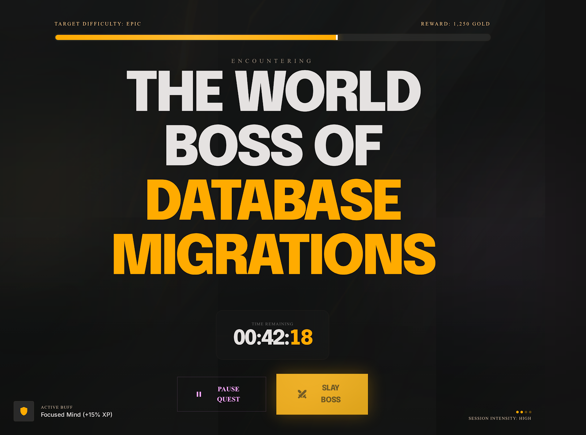

# TaskSlayer Docker Setup

TaskSlayer convierte tareas en quests tipo RPG, con tablero de quests, forge de tareas, sesiones activas estilo boss battle, treasury y métricas de progreso.

## Vista de referencia



Stack local inicial:

- PostgreSQL 16
- Laravel (PHP 8.3 + Apache)
- Frontend con Node 22

## 1) Preparar variables

```bash
cp .env.example .env
```

Si tu usuario local no usa UID/GID `1000`, define esto en el `.env` del root del proyecto:

```bash
LOCAL_UID=1000
LOCAL_GID=1000
```

En Linux puedes obtenerlos con:

```bash
id -u
id -g
```

## 2) Levantar infraestructura

```bash
docker compose up -d --build
```

Si ya habías creado archivos del backend como `root`, reconstruye y corrige ownership una vez:

```bash
docker compose down
docker compose up -d --build
docker compose run --rm --user root backend sh -c "chown -R ${LOCAL_UID:-1000}:${LOCAL_GID:-1000} /var/www/html"
```

Servicios:

- Backend: http://localhost:8080
- Frontend: http://localhost:5173
- PostgreSQL: localhost:5432

## 3) Inicializar Laravel (si aun no existe)

Si la carpeta aun no tiene un proyecto Laravel:

```bash
docker compose run --rm backend composer create-project laravel/laravel .
```

Luego instala dependencias y genera APP_KEY:

```bash
docker compose exec backend composer install
docker compose exec backend cp .env.example .env
docker compose exec backend php artisan key:generate
docker compose exec backend php artisan migrate
```

## 4) Frontend Node 22

El servicio frontend ejecuta automaticamente:

- npm install
- npm run dev -- --host 0.0.0.0 --port 5173

Si package.json no existe, el contenedor queda en espera mostrando un mensaje.

## 5) Integracion con LM Studio

El Forge usa LM Studio para transformar una tarea normal en una quest RPG desde el endpoint interno [fronten/src/routes/forge/generate/+server.js](fronten/src/routes/forge/generate/+server.js).

Variables soportadas en el `.env` del proyecto:

```bash
LMSTUDIO_BASE_URL=http://127.0.0.1:1234/v1
LMSTUDIO_MODEL=local-model
LMSTUDIO_API_KEY=
```

Notas de integracion:

- `LMSTUDIO_BASE_URL` debe apuntar a una API compatible con OpenAI Chat Completions.
- Si LM Studio corre en tu host local, el backend del frontend intenta automaticamente varias rutas: `127.0.0.1`, `host.docker.internal` y `172.17.0.1`.
- `LMSTUDIO_API_KEY` es opcional. Solo se envia como bearer token si existe.
- El Forge pide JSON valido con estas claves: `boss_name`, `narrative`, `difficulty_level`, `reward_points`, `tags`.
- La descripcion final siempre conserva primero la instruccion original del usuario y luego el texto generado por el modelo.

Si LM Studio no responde o devuelve una salida invalida, la app cae automaticamente a un modo deterministico para que el Forge siga funcionando sin bloquear la creacion de tareas.

## 6) Comandos utiles

```bash
docker compose ps
docker compose logs -f backend
docker compose logs -f frontend
docker compose down
docker compose down -v
```

## 7) Aliases del proyecto

Se agregó un [Makefile](Makefile) para no repetir comandos largos.

```bash
make up
make ps
make logs-backend
make composer cmd="install"
make artisan cmd="migrate"
make key
make fix-perms
```

Para ver todos los aliases disponibles:

```bash
make help
```
